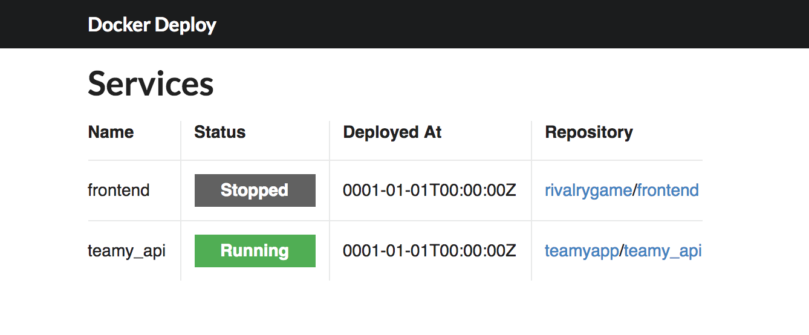
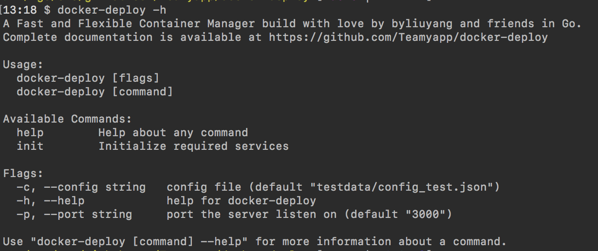

# Docker Deploy

A easy to use container manager

## Preview

### Web Dashboard


### Command Line Tool


## Getting Started

### Prerequistes

- Go v1.10.2
- Docker v18.03.1

### Installing
Run the following command to download and install Docker Deploy:

```
go get github.com/Teamyapp/docker-deploy
```
### Initialization

1. Start Docker daemon.

2. Navigate to the root folder of this repo, and run:

```
docker-deploy init
```

to automically build and configure web dashboard.

### Usage

To launch the server, run:

```
docker-deploy -p 8000
```

and visit

```
http://localhost:8000
```

in your web broswer.

### Available Commands

To see the available commands provided by Docker Deploy, run:

```
docker-deploy -h
```

You should see the following output in the terminal:

```
$ docker-deploy -h
A Fast and Flexible Container Manager build with love by byliuyang and friends in Go.
Complete documentation is available at https://github.com/Teamyapp/docker-deploy

Usage:
  docker-deploy [flags]
  docker-deploy [command]

Available Commands:
  help        Help about any command
  init        Initialize required services

Flags:
  -c, --config string   config file (default "testdata/config_test.json")
  -h, --help            help for docker-deploy
  -p, --port string     port the server listen on (default "3000")

Use "docker-deploy [command] --help" for more information about a command.
```

## Contributing
### Pull Request Process

1. Ensure any install or build dependencies are removed before the end of the layer when doing a build.
2. Update the README.md with details of changes to the interface, this includes new environment variables, exposed ports, useful file locations and container parameters.
3. Increase the version numbers in any examples files and the README.md to the new version that this Pull Request would represent. The versioning scheme we use is SemVer.
4. You may merge the Pull Request in once you have the sign-off of two other developers, or if you do not have permission to do that, you may request the second reviewer to merge it for you.

### Code of Conduct

- Using welcoming and inclusive language
- Being respectful of differing viewpoints and experiences
- Gracefully accepting constructive criticism
- Focusing on what is best for the community
- Showing empathy towards other community members

## Versioning
We use SemVer for versioning.

## Authors

- **Harry Liu** - *Initial work* - [byliuyang](https://github.com/byliuyang)
- **Albert Wang** - *Significant code refactor* - [CreatCodeBuild](https://github.com/CreatCodeBuild)

## License
This project is maintained under MIT license.

